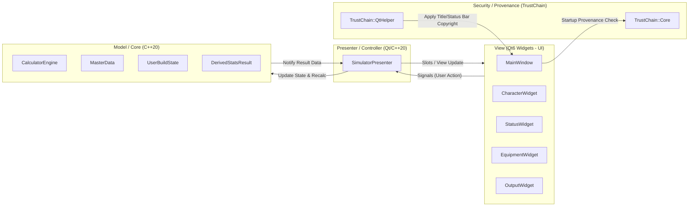

# ROLC ステータスシミュレーター 基本設計書

- **文書バージョン**: 1.7.0
- **最終更新日**: 2026-08-06
- **対象システム**: ROLC ステータスシミュレーター (Qt6 / C++20)

---

## 1. システムアーキテクチャ概要 (MVP パターン & TrustChain 統合)

UI層（Qt6 Widgets）とビジネスロジック（C++20 Domain Engine）を徹底的に分離するため、**Model-View-Presenter (MVP)** パターンを採用する。また起動時に **TrustChain** セキュリティガードが組み込まれる。

---

## 2. コンポーネントおよびモジュール設計

### (1) セキュリティ・出自証明モジュール (`Lib/TrustChain`, `Lib/TransCipher`)
- `TrustChain`: ビルド時に Git レポジトリの commit hash / status / remote origin とソースツリーの整合性を全自動検証し、TransCipher トークンを埋め込む。
- 起動時に `TrustChain::Core::verifyToken()` をコールし、`.git` の非存在・ソース非整合・オフライン等の未承認ビルド検出時に `TrustChain::QtHelper::applyWatermark()` 経由でタイトルバーおよびステータスバーへコピーライト（`© BLUE000 (Original Creator)`）を自動保護表示する。

### (2) ドメインコア (`Lib/ROLC_Core`) - C++20 (Qt非依存)
- `UserBuildState`: ユーザー選択ビルド状態を保持する値オブジェクト。
- `CalculatorEngine`: 「最終実ステータス」および「理論最大値」を高速算出する計算エンジン。
- `MasterData`: キャラクター、クラス、公式ステータス称号、アンプ、シェア別レベル上限データの静的定義リポジトリ。

### (3) 画面ビュー層 (`App/View`) - Qt6 Widgets
- `MainWindow`: アプリメインウィンドウ。起動時に `TrustChain::QtHelper::applyWatermark` の適用を受け、タイトルのタグ追加およびステータスバーへのコピーライト保護描画を行う。
