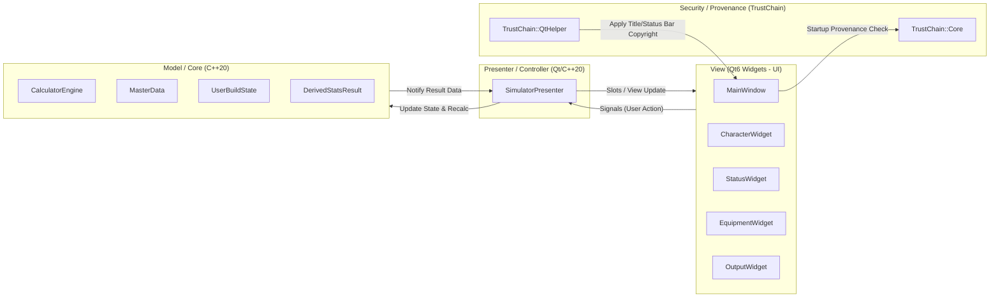

# ROLC ステータスシミュレーター 基本設計書

- **文書バージョン**: 1.8.0
- **最終更新日**: 2026-08-06
- **対象システム**: ROLC ステータスシミュレーター (Qt6 / C++20)

---

## 1. システムアーキテクチャ概要 (MVP パターン & TrustChain 統合)

UI層（Qt6 Widgets）とビジネスロジック（C++20 Domain Engine）を徹底的に分離するため、**Model-View-Presenter (MVP)** パターンを採用する。

---

## 2. コンポーネントおよびモジュール設計

### (1) 画面ビュー層 (`App/View`) - Qt6 Widgets
- `CharacterWidget`:
  - **エピソード/編区分 ComboBox (`m_editionCombo`)**: 「王国編」「大地編」を選択。
  - **シェア/章 ComboBox (`m_shareCombo`)**: 編区分選択に応じて対応シェア（王国編フリー、大地編フリー、メイキング、各章ダンジョン）を動的フィルタリング表示。
  - **レベル上限提示ラベル (`m_levelLimitNoticeLabel`)**: 編区分に応じて `[レベル上限: Lv50 (王国編)]` または `[レベル上限: Lv100 (大地編)]` を動的バッジ表示。

### (2) プレゼンター層 (`App/Presenter`) - Qt6 / C++20 (自動テスト対象)
- `SimulatorPresenter`:
  - 編区分選択 (`onEditionSelected`) および シェア選択 (`onShareCategorySelected`) イベントを個別にハンドリング。
  - 編区分 `Edition::Kingdom` の場合はレベル上限 50、`Edition::Earth` の場合はレベル上限 100 を設定・適用。

### (3) ドメインコア (`Lib/ROLC_Core`) - C++20 (Qt非依存)
- `MasterData`: 編区分（王国編 vs 大地編）に属するシェアデータ一覧、およびキャラクターデータの動的検索・返却関数を提供する。
